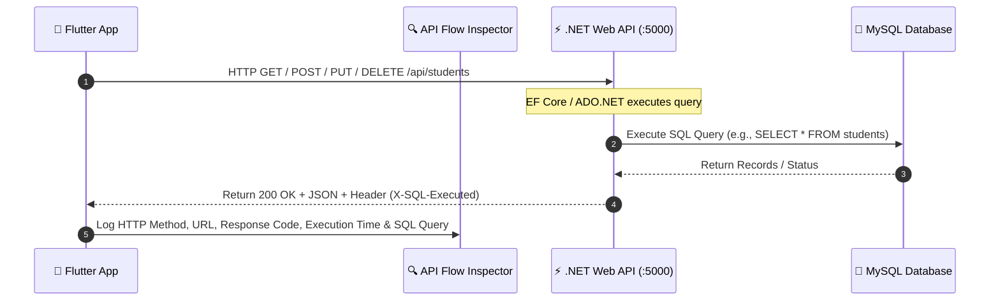

# 📱 Flutter App - API Workflow

  

A Flutter client application communicating with a **.NET 8 Web API** and **MySQL** database with an in-app **API Flow Inspector**.

---

## 🔄 Application API Workflow

---

This project is a starting point for a Flutter application.

A few resources to get you started if this is your first Flutter project:

- [Learn Flutter](https://docs.flutter.dev/get-started/learn-flutter)
- [Write your first Flutter app](https://docs.flutter.dev/get-started/codelab)
- [Flutter learning resources](https://docs.flutter.dev/reference/learning-resources)

For help getting started with Flutter development, view the
[online documentation](https://docs.flutter.dev/), which offers tutorials,
samples, guidance on mobile development, and a full API reference.
