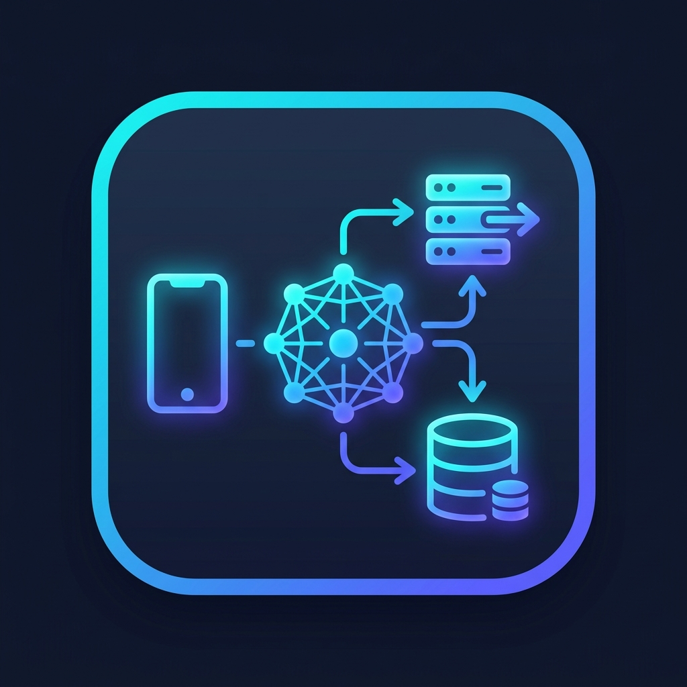
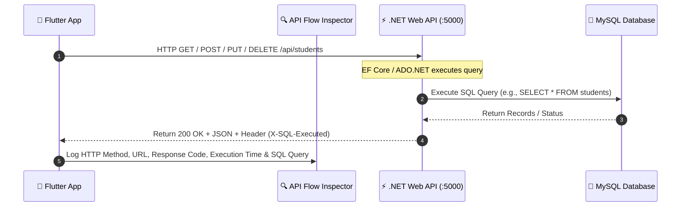

# 🚀 API Workflow

<p align="center">
  
</p>

A complete learning project demonstrating how a **Flutter** application communicates with a **.NET Web API** and **MySQL** database using REST APIs.

---

## 🔄 Application API Workflow Architecture



---

## 📚 Tech Stack

| Layer         | Technology                  |
| ------------- | --------------------------- |
| Frontend      | Flutter                     |
| Backend       | ASP.NET Core Web API (.NET) |
| Database      | MySQL                       |
| Communication | REST API (HTTP/HTTPS)       |
| Data Format   | JSON                        |

---

# 📂 Project Structure

```text
API-Workflow
│
├── Flutter-App
│   ├── lib
│   │   ├── models
│   │   ├── services
│   │   ├── screens
│   │   └── widgets
│   └── pubspec.yaml
│
├── DotNet-WebAPI
│   ├── Controllers
│   ├── Models
│   ├── Data
│   ├── Services
│   ├── Repositories
│   └── Program.cs
│
├── Database
│   ├── schema.sql
│   └── sample-data.sql
│
└── README.md
```

---

# 🔄 Complete API Workflow

```text
                USER
                  │
                  ▼
        Flutter Mobile App
                  │
                  │ HTTP Request
                  ▼
            Internet (REST API)
                  │
                  ▼
        ASP.NET Core Web API
                  │
          Controller receives request
                  │
                  ▼
           Business Logic / Service
                  │
                  ▼
             Repository Layer
                  │
                  ▼
             MySQL Database
                  │
          Execute SQL Query
                  │
                  ▼
             Return Result
                  │
                  ▼
       Convert Data to JSON
                  │
                  ▼
           HTTP Response
                  │
                  ▼
          Flutter receives JSON
                  │
                  ▼
      Parse JSON → Dart Objects
                  │
                  ▼
           Display on Screen
```

---

# 📡 API Request Flow

## GET Request

```text
Flutter
   │
   ├── GET /api/students
   ▼
.NET API
   │
   ▼
MySQL
   │
SELECT * FROM Students
   │
   ▼
JSON Response
   │
   ▼
Flutter UI
```

---

## POST Request

```text
User fills Form
        │
        ▼
Flutter
        │
POST /api/students
        │
        ▼
.NET Controller
        │
Validate Data
        │
        ▼
MySQL
INSERT INTO Students(...)
        │
        ▼
Success Response
        │
        ▼
Flutter shows Success Message
```

---

## PUT Request

```text
Flutter
      │
PUT /api/students/{id}
      │
      ▼
.NET API
      │
UPDATE Student
      │
      ▼
MySQL
      │
      ▼
Updated JSON Response
      │
      ▼
Flutter UI Refresh
```

---

## DELETE Request

```text
Flutter
      │
DELETE /api/students/{id}
      │
      ▼
.NET API
      │
DELETE FROM Students
      │
      ▼
MySQL
      │
      ▼
Success Response
      │
      ▼
Flutter removes Item
```

---

# 📦 JSON Communication

### Request

```json
{
  "name": "Prit Dhanani",
  "email": "prit@gmail.com",
  "course": "Flutter & .NET Development"
}
```

### Response

```json
{
  "id": 1,
  "name": "Prit Dhanani",
  "email": "prit@gmail.com",
  "course": "Flutter & .NET Development",
  "createdAt": "2026-08-03T13:20:00Z"
}
```

---

# 🎯 Learning Objectives

* Understand REST API architecture
* Learn HTTP methods (GET, POST, PUT, DELETE)
* Connect Flutter with a .NET backend
* Work with MySQL databases
* Handle JSON serialization/deserialization
* Implement CRUD operations
* Understand client-server communication
* Build a scalable API architecture

---

# 🚀 Future Enhancements

* JWT Authentication
* Role-Based Authorization
* Repository Pattern
* Dependency Injection
* Clean Architecture
* Logging
* Exception Handling
* File Upload API
* Pagination & Filtering
* Search API
* Docker Support
* Cloud Deployment (Azure/AWS)

---

# 👨‍💻 Author

**Prit Dhanani**

This repository is created for learning and understanding the complete API workflow between Flutter, .NET Web API, and MySQL using modern development practices.
